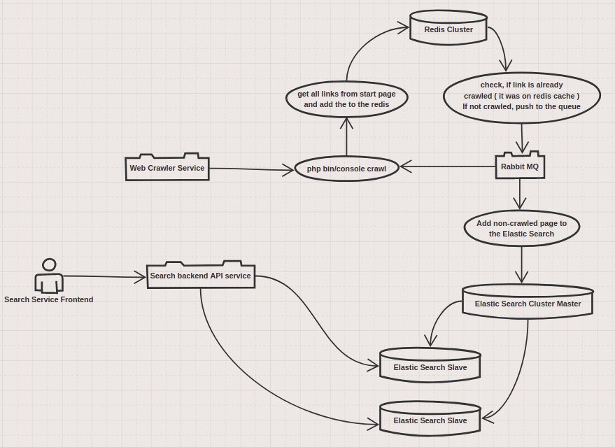

# Web Crawler

Web Crawler - the service, which allow you to search the crawled websites in Wikipedia

## Prerequsites
- node v10.x.x
- npm v7.x.x
- docker v20.x.x
- docker-compose v1.25.x

## Architecture

## Services:
1) Web crawler service - to crawl and store the links and page data
2) Search backend api - service to search the links
3) search frontend - frontend for search

## How to run the project:

### 1) Increase ES memory

For windows you'll need to increase memory for ES via wsl
`wsl -d docker-desktop`
then
`_sysctl -w vm.max_map_count=262144_`

For linux `_sysctl -w vm.max_map_count=262144_` and `chmod 777 .docker/elasticsearch -R` to allow access to elasticSearch folder from docker
### 2) Install vendor PHP dependecies for Web Crawler Service
In web-crawler-service folder run `sudo docker-compose run php composer install`
### 3) Run docker
In web-crawler-service run `docker-compose up` to initialize running 
### 4) Run console crawler
Start the crawling proceess via `sudo docker-compose run php bin/console crawl`. It will proccess of adding message with pages metadata to RabbitMQ
### 5) Redis issue
You need to check redis port in the log and directly change it in "web-crawler-service/src/Service/CrawlService.php". This is because Redis-clusted docker issue bug
### 6) Run workers
You need to activate workers to store and indexing the data from the RabbitMQ. For this you need to run `docker run worker` with docker-compose running in the background
### 7) Run backend for search the links
In search-service/search-backend-api run `docker-comppose up` and install the node modules
### 8) Run frontend
In search-service/search-fronend install node modules and run `npm start` with your local nodejs

You are done :)
## Tools Navigator
- RabbitMQ Admin - **http://localhost:15672/**
- Redis Admin ( RedisInsight ) - **http://localhost:8001/**
- Elastic Search Admin  ( elasticsearchHQ )- **http://localhost:5000/**
- App frontend ( **http://localhost:4222/**)
- App backend ( **http://localhost:3000/**)
## Features for the next Release
- Page Rank ( sort pages by count of links, which leads to this particular link )
- Add software load balancer
